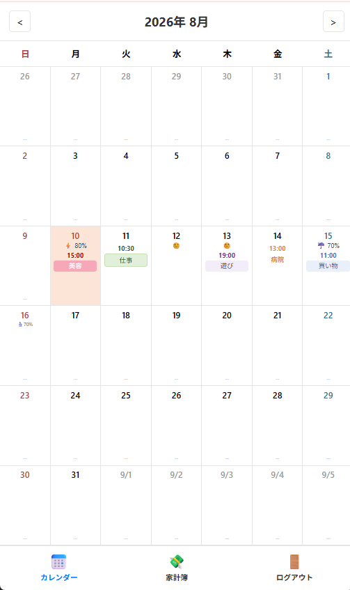
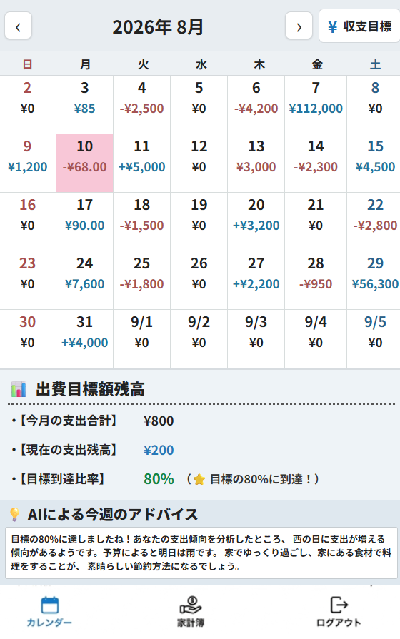

# アプリケーション「やくそくん」

予定や約束を直感的に共有・管理できるWebアプリケーションです。  
日常のタスクや約束事をシンプルに管理・確認するためのWebサービスとして開発しました。  
ユーザーが迷わず直感的に使えるUIと、安定したデータ管理・外部連携を意識しています。

👉 **[Web版 要件定義書・画面設計書はこちら（GitHub Pages）](https://hadano-nobuyuki.github.io/project/)**  
*(※システム仕様・各画面イメージ・業務フローの詳細をWebページ形式でご覧いただけます)*

---

## 💻 画面イメージ

### カレンダー

### 家計簿

---

## 🧰 主な使用技術
* **バックエンド**: Java (Servlet / JSP), Apache Tomcat
* **データベース**: PostgreSQL
* **インフラ**: AWS (EC2)

---

## 🌐 動作確認（デモ環境）
AWS上にデプロイしており、実際に動作を確認いただけます。

👉 **[「やくそくん」デモサイトはこちら](http://13.55.243.219:8080/project/login)**

> **テスト用ログイン情報**  
> * **ID**: guest_user  
> * **パスワード**: password123  
> *(※必要に応じて用意したテストアカウント情報を記載)*
